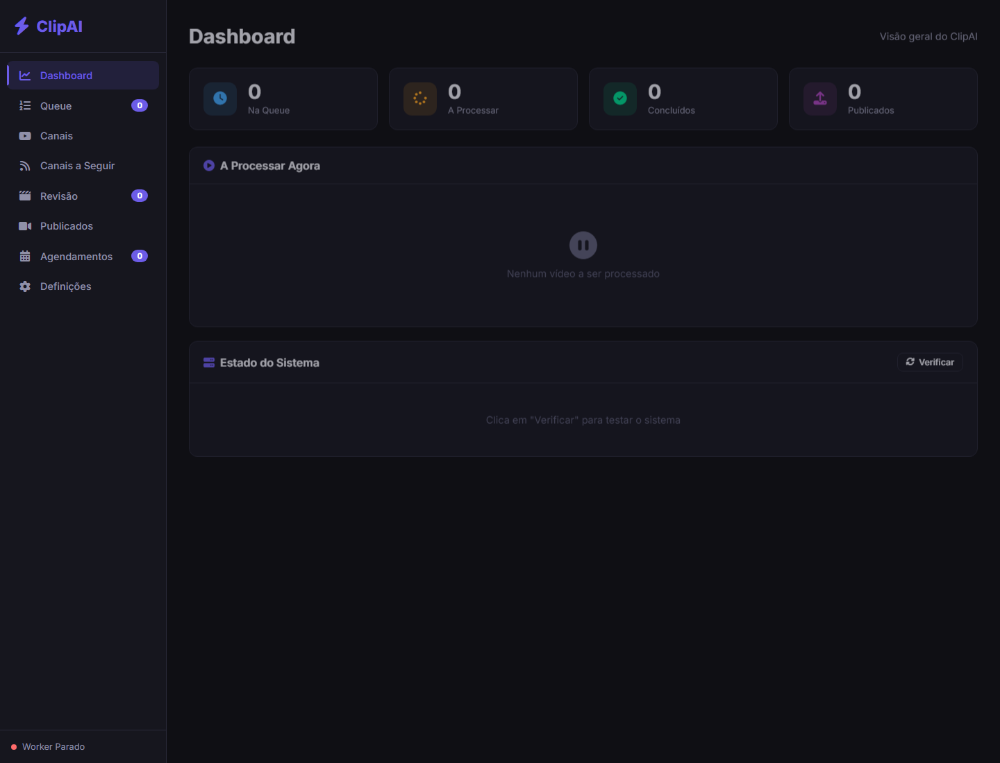

# ClipAI


ClipAI is a local AI-assisted video automation system for turning long-form YouTube videos into short-form clips. It combines downloading, transcription, local LLM analysis, automated editing, a review dashboard, and optional YouTube publishing.

## Preview



Additional demo assets can be added here:

| Type | Path | Notes |
| --- | --- | --- |
| Screenshots | `docs/assets/screenshots/` | Real dashboard screenshot currently available as `home.png`. |
| GIFs | `docs/assets/gifs/` | Add short workflow GIFs when a stable demo dataset is available. |
| Videos | `docs/assets/videos/` | Add short MP4/WebM demos for queue processing or publishing flows. |

## Overview

ClipAI automates the workflow of converting source videos into short-form clips:

```text
YouTube URL or local video
  -> download / ingest
  -> audio extraction
  -> speech transcription
  -> local LLM clip analysis
  -> automated vertical editing
  -> review queue
  -> optional YouTube publishing
```

The project is designed for local execution. It uses local files for runtime state, generated media, and OAuth tokens, so private configuration must stay outside Git.

## Features

- Web dashboard for queue management, channels, schedules, review, and settings.
- YouTube video download via `yt-dlp`, with proxy support and an optional RapidAPI fallback.
- Local transcription with Faster-Whisper.
- Local clip selection and metadata generation through Ollama.
- Automated vertical video editing with FFmpeg/OpenCV, subtitles, dynamic crop/zoom, and loop handling.
- Review workflow for generated clips before publishing.
- Optional YouTube Data API publishing with OAuth and credential rotation.
- Local JSON database for queues, channels, review clips, posted videos, and scheduler state.
- "Clippy" character utilities for animated hooks, voice, and interventions.

## Tech Stack

| Area | Technology |
| --- | --- |
| Language | Python 3.9+ |
| Web app | Flask, Jinja templates, vanilla JavaScript, CSS |
| Video download | `yt-dlp`, optional RapidAPI fallback |
| Transcription | Faster-Whisper |
| LLM analysis | Ollama |
| Video processing | FFmpeg, FFprobe, MoviePy, OpenCV |
| Image / TTS | Pillow, edge-tts |
| Publishing | Google API Python Client, YouTube Data API OAuth |
| Storage | Local JSON database under `data/` |

## Architecture / Project Structure

```text
.
|-- app.py                    # Flask web dashboard and HTTP API
|-- worker.py                 # Background queue worker
|-- database.py               # Local JSON persistence layer
|-- modulo1_download.py       # YouTube/local video ingestion
|-- modulo2_analise.py        # Audio extraction, Whisper, Ollama analysis
|-- modulo3_edicao.py         # FFmpeg/OpenCV editing pipeline
|-- personagem_clippy.py      # Clippy character rendering, TTS, hooks
|-- credentials_rotation.py   # Google OAuth credential discovery/rotation
|-- proxy_rotator.py          # Public proxy discovery and rotation helpers
|-- auto_manager.py           # Playlist/channel auto-scan manager
|-- templates/index.html      # Dashboard shell
|-- static/app.js             # Dashboard client logic
|-- static/style.css          # Dashboard styling
|-- docs/assets/              # Screenshots, GIFs, and videos for docs
|-- test_*.py                 # Script-style smoke/manual tests
|-- requirements.txt          # Python dependencies
|-- .env.example              # Safe environment variable template
```

## Getting Started

The shortest local path is:

```powershell
git clone https://github.com/2mas-magalhaes/ClipperAI.git
cd ClipperAI

python -m venv venv
.\venv\Scripts\activate

$env:PYTHONUTF8 = "1"
$env:PYTHONIOENCODING = "utf-8"
python -m pip install -r requirements.txt

Copy-Item .env.example .env
python app.py
```

Then open:

```text
http://localhost:5000
```

## Prerequisites

- Python 3.9 or newer.
- FFmpeg and FFprobe available in `PATH`.
- Ollama installed locally for AI analysis.
- At least one Ollama model pulled locally, for example `llama3.1`.
- Enough disk space for downloaded source videos and generated clips.
- Optional NVIDIA GPU/CUDA for faster transcription and video processing.
- Optional Google Cloud OAuth client credentials for YouTube publishing.

Recommended checks:

```powershell
python --version
ffmpeg -version
ffprobe -version
ollama --version
ollama list
```

## Installation

Create and activate a virtual environment:

```powershell
python -m venv venv
.\venv\Scripts\activate
```

Install dependencies:

```powershell
$env:PYTHONUTF8 = "1"
$env:PYTHONIOENCODING = "utf-8"
python -m pip install -r requirements.txt
```

On Windows, the UTF-8 environment variables avoid encoding errors when reading UTF-8 project files.

Install an Ollama model:

```powershell
ollama pull llama3.1
```

## Environment Variables

Copy `.env.example` to `.env` and fill only local values:

```powershell
Copy-Item .env.example .env
```

| Variable | Required | Description |
| --- | --- | --- |
| `OLLAMA_MODEL` | Recommended | Local Ollama model used for clip analysis. |
| `OLLAMA_API_URL` | Recommended | Ollama API URL, usually `http://localhost:11434`. |
| `OLLAMA_TIMEOUT` | Optional | Timeout for local LLM calls. |
| `WHISPER_MODEL` | Optional | Default Faster-Whisper model. |
| `WHISPER_LANGUAGE` | Optional | Transcription language hint. |
| `WHISPER_DEVICE` | Optional | `cpu` or `cuda`. |
| `WHISPER_COMPUTE_TYPE` | Optional | Faster-Whisper compute type. |
| `RAPIDAPI_KEY` | Optional | Enables the RapidAPI download fallback. Leave empty to disable. |
| `GOOGLE_CREDENTIALS_FILES` | Optional | Local OAuth credential paths for rotation. Do not commit these files. |
| `YOUTUBE_OUTPUT_DIR` | Optional | Runtime output directory for downloaded media. |
| `AUDIO_OUTPUT_DIR` | Optional | Runtime output directory for audio artifacts. |
| `VIDEO_OUTPUT_DIR` | Optional | Runtime output directory for generated videos. |

Never commit `.env`, Google OAuth client files, generated OAuth tokens, `data/`, `downloads/`, or generated media.

## Running Locally

Start the web app:

```powershell
$env:PYTHONUTF8 = "1"
$env:PYTHONIOENCODING = "utf-8"
python app.py
```

The Flask server runs on:

```text
http://localhost:5000
```

The app starts the queue worker on boot. If your local `data/clipai_db.json` already contains queued items, the worker can start processing them immediately. Use the dashboard worker control or this API call to stop it:

```powershell
Invoke-WebRequest -UseBasicParsing -Method POST http://localhost:5000/api/worker/stop
```

Run the direct script pipeline:

```powershell
python main.py
```

This path downloads and processes the sample URL currently defined in `main.py`; review it before running against live media.

## Build

There is no separate frontend bundling or production build step. The app is a Flask server with static JavaScript/CSS.

Useful validation command:

```powershell
$env:PYTHONUTF8 = "1"
python -m compileall app.py worker.py database.py modulo1_download.py modulo2_analise.py modulo3_edicao.py personagem_clippy.py
```

## Tests

This repository currently contains script-style tests rather than a formal `pytest` suite:

| Script | Purpose | Notes |
| --- | --- | --- |
| `test_autopublish.py` | Inspects local auto-publishing configuration. | Reads local runtime data and prints a report. |
| `test_clippy_v3.py` | Exercises Clippy rendering, animation, TTS, and AI hooks. | Requires FFmpeg and may require network/Ollama. |
| `test_edicao.py` | Validates loop editing with existing local MP4 files. | Requires local media under `downloads/` and opens the output file. |

Safe syntax/build validation:

```powershell
$env:PYTHONUTF8 = "1"
python -m compileall app.py worker.py database.py modulo1_download.py modulo2_analise.py modulo3_edicao.py personagem_clippy.py
```

Configuration smoke test:

```powershell
$env:PYTHONUTF8 = "1"
python test_autopublish.py
```

Recommended next step: convert the script-style tests into a `pytest` suite with fixtures for temporary databases, sample media, mocked Ollama responses, and mocked YouTube API clients.

## Screenshots / Demo

Current screenshot:


Suggested future demo captures:

- `docs/assets/gifs/queue-processing.gif` showing queue add -> worker progress -> review.
- `docs/assets/gifs/review-publish.gif` showing review metadata and publish action.
- `docs/assets/videos/end-to-end-demo.mp4` using a non-private demo video and dummy publishing configuration.

## Roadmap

- Add a formal automated test suite with mocked external services.
- Add a small, safe demo dataset for repeatable screenshots and GIFs.
- Add CI for Python syntax checks, dependency installation, and security scanning.
- Add a production deployment guide if the project moves beyond local development.
- Add structured logging with secret redaction for OAuth and publishing flows.

## Security

- Secrets must live in `.env` or local credential files only.
- OAuth client files and generated tokens are ignored by `.gitignore`.
- `RAPIDAPI_KEY` is read from the environment; the RapidAPI fallback is disabled when it is empty.
- Runtime state under `data/` and generated media under `downloads/` are ignored.
- If a secret has ever been committed, revoke or rotate it outside this repository and clean Git history before treating the repository as safe.

See [`docs/SECURITY_AUDIT.md`](docs/SECURITY_AUDIT.md) for the current audit notes and history-cleanup recommendations.

## Contributing

1. Create a branch from `main`.
2. Keep generated media, `.env`, tokens, and OAuth files out of Git.
3. Run installation and validation commands before opening a PR.
4. Document any external services required by your change.
5. Include screenshots or short demo clips for dashboard changes.

## License

This project is released under the MIT License. See [`LICENSE`](LICENSE).

## Authors / Maintainers

- ClipAI contributors
- Repository: [`2mas-magalhaes/ClipperAI`](https://github.com/2mas-magalhaes/ClipperAI)
