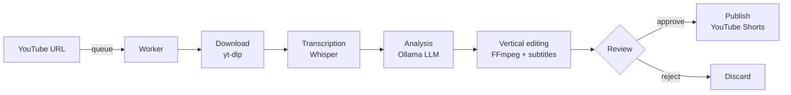
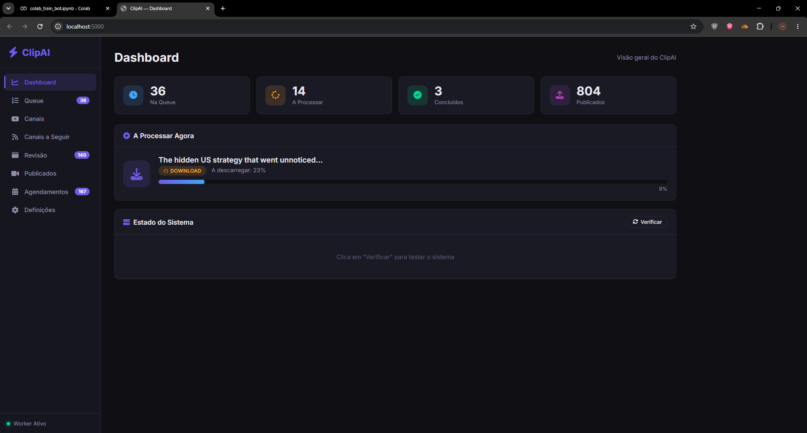
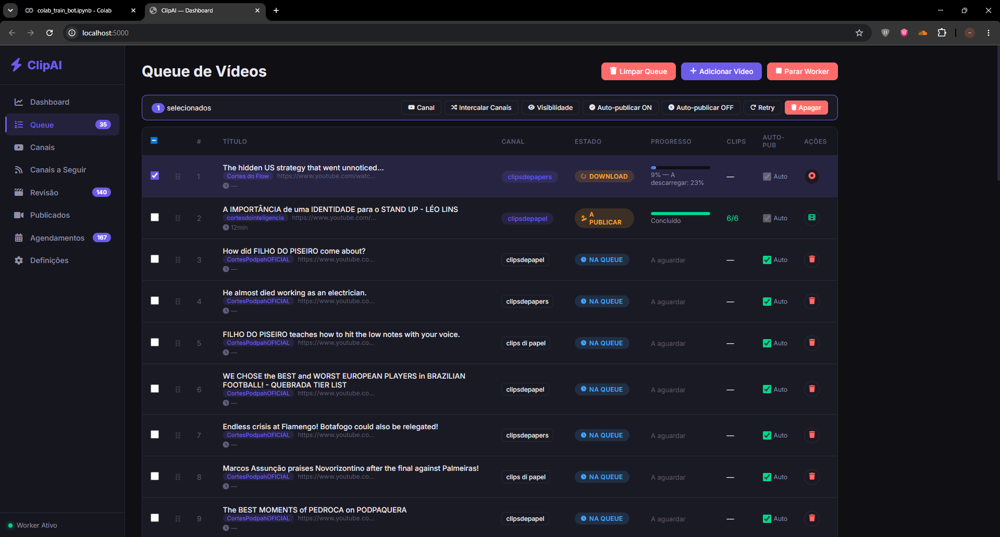
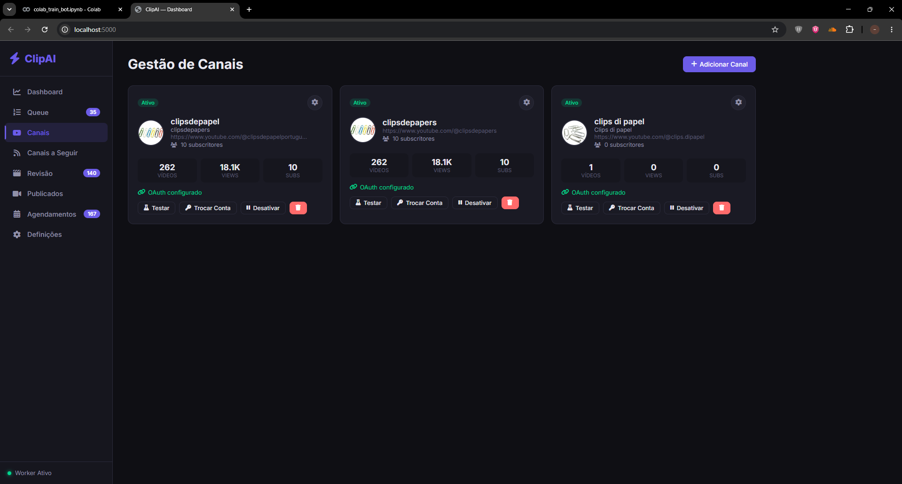
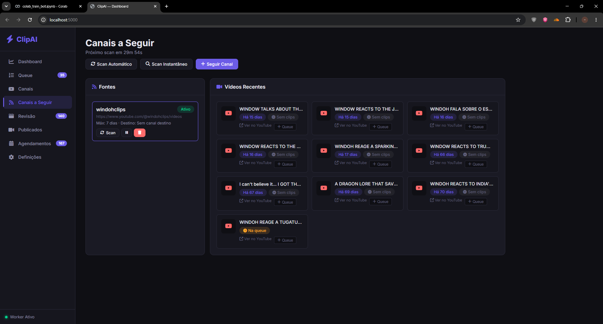
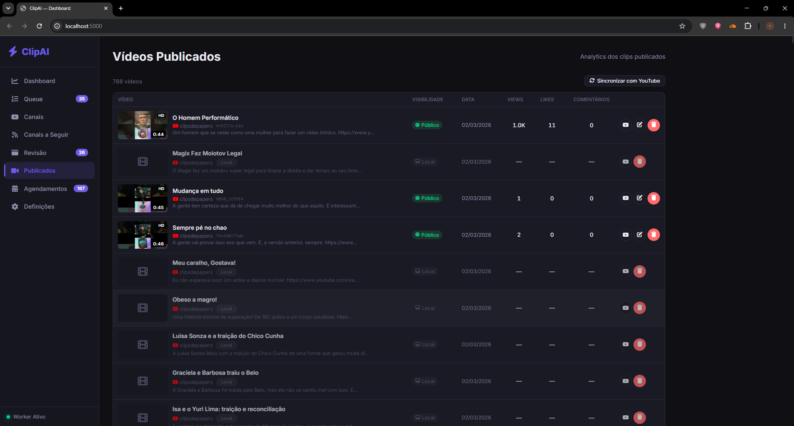
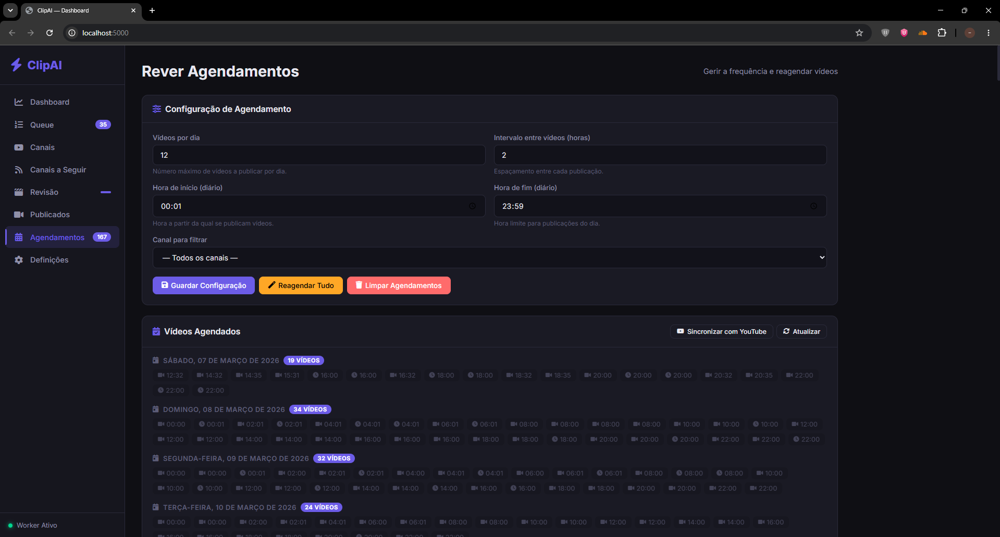
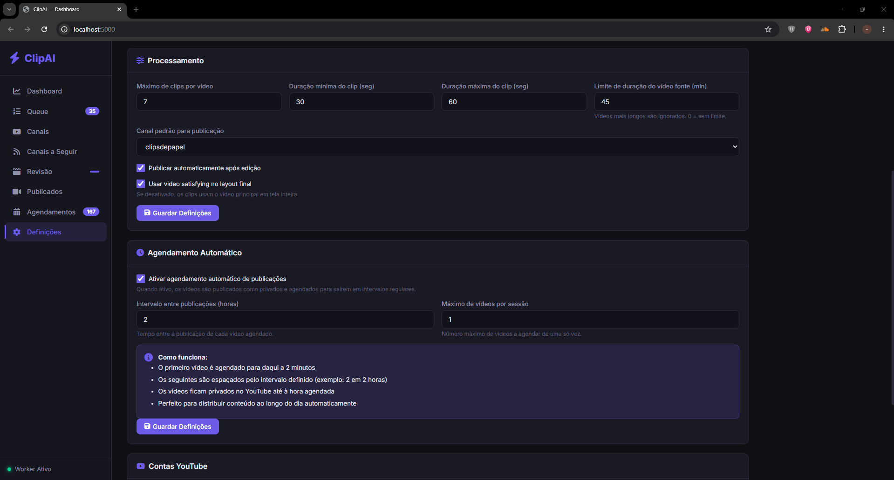

<div align="center">



<h1>ClipAI</h1>

<p><strong>Turn long YouTube videos into vertical Shorts — transcribed, clipped, captioned and published. 100% local.</strong></p>

<p>
  
  
  
  
  
  
</p>

</div>

---

## Overview

**ClipAI** takes long **YouTube** videos, transcribes them with **Whisper**, uses a local **LLM (Ollama)** to pick the best moments, edits them into **vertical clips with subtitles**, and optionally publishes them to **YouTube Shorts**.

You drop a URL into the queue, and a background worker handles the rest: it downloads the video, transcribes the audio, asks Ollama to choose the most interesting moments, edits each clip into vertical format, and queues them for review before publishing.

> [!NOTE]
> Everything runs **locally** — no cloud, no subscriptions, no data leaving your machine. The only optional external pieces are a YouTube OAuth connection (for publishing) and an optional RapidAPI download fallback.

---

## Demo

<div align="center">

[](https://www.youtube.com/watch?v=O3AHu_EP7CM)

<sub>A full end-to-end walkthrough of ClipAI.</sub>

</div>

---

## How it works



```text
YouTube URL → download → transcription (Whisper) → analysis (Ollama)
  → vertical editing with subtitles → review → publish to YouTube
```

---

## Features

- **End-to-end pipeline** — from a single YouTube URL to a finished, captioned vertical clip.
- **Local LLM analysis** — Ollama picks the most relevant moments; no cloud AI, no per-token cost.
- **Whisper transcription** — accurate speech-to-text with optional GPU/CUDA acceleration.
- **Vertical editing** — automatic 9:16 reframing with burned-in subtitles via FFmpeg/OpenCV.
- **Intro hooks** — an optional character adds a generated hook and natural TTS voice to each clip.
- **Watched channels** — auto-scans source channels and queues fresh videos automatically.
- **Scheduling** — spread uploads across the day with configurable frequency and day windows.
- **Review before publish** — preview, multi-select, reject weak cuts, publish only the best.
- **Multi-channel publishing** — connect several YouTube channels via OAuth with credential rotation.
- **Live dashboard** — counters, worker status, queue progress and published history at a glance.

---

## The app

### Dashboard



Main dashboard — counters for videos in queue, processing, done and published, plus the worker status and what's currently being downloaded.

### Queue



Video Queue — every video waiting to be processed, with title, target channel, status (downloading, publishing, queued), progress and quick actions (retry, delete, change channel, auto-publish).

### Channels



Channel Management — connect YouTube channels via OAuth for publishing. Each card shows subscribers, published videos and views, and lets you test the connection, swap accounts or disable the channel.

### Watched Channels



Watched Channels — ClipAI auto-scans these source channels looking for new videos to clip. Each video shows how long ago it was published, whether clips already exist, and can be queued in one click.

### Review

Review — before publishing, preview each generated clip, select multiple items, reject weak cuts, and publish only the best ones.

### Published



Published Videos — complete history of published clips with thumbnail, title, visibility, views, likes, comments, and one-click links to open the video on YouTube.

### Scheduling



Scheduling — configure posting frequency, day window, and bulk rescheduling. ClipAI can spread uploads across the day automatically.

### Settings



Settings — central control for clip generation defaults (durations, max clips, channel, AI model selection, auto-publish and satisfying layout), plus YouTube account management and OAuth checks.

---

## Tech Stack

| Layer | Technologies |
|-------|-------------|
| **Backend** | Python 3.9+, Flask web dashboard & HTTP API, background queue worker |
| **AI / ML** | Faster-Whisper (transcription), Ollama + Llama 3.x (analysis & hooks), Microsoft Edge TTS |
| **Media** | yt-dlp (download), FFmpeg / FFprobe, OpenCV, MoviePy, optional NVIDIA CUDA |
| **Publishing** | Google / YouTube Data API (OAuth), credential rotation, optional RapidAPI fallback |
| **Storage** | Local JSON persistence (`data/clipai_db.json`) |
| **Frontend** | HTML, CSS, vanilla JavaScript dashboard |

---

## Requirements

- **Python** 3.9+
- **FFmpeg** and **FFprobe** on `PATH`
- **Ollama** installed with at least one model pulled (e.g. `ollama pull llama3.1`)
- Enough disk space for downloaded videos and generated clips
- *Optional:* NVIDIA GPU / CUDA for faster transcription
- *Optional:* Google OAuth credentials to publish to YouTube

---

## Getting Started

### 1. Clone

```powershell
git clone https://github.com/2mas-magalhaes/ClipperAI.git
cd ClipperAI
```

### 2. Environment

```powershell
python -m venv venv
.\venv\Scripts\activate

$env:PYTHONUTF8 = "1"
$env:PYTHONIOENCODING = "utf-8"
python -m pip install -r requirements.txt
```

### 3. Configure & run

```powershell
Copy-Item .env.example .env
python app.py
```

Then open **[http://localhost:5000](http://localhost:5000)**.

---

## Configuration (.env)

Copy `.env.example` to `.env` and fill in what you need:

| Variable | Description |
| --- | --- |
| `OLLAMA_MODEL` | Local model to use for analysis (e.g. `llama3.1`) |
| `OLLAMA_API_URL` | Ollama API URL, usually `http://localhost:11434` |
| `WHISPER_MODEL` | Faster-Whisper model (e.g. `medium`) |
| `RAPIDAPI_KEY` | Optional — enables RapidAPI download fallback |
| `GOOGLE_CREDENTIALS_FILES` | Local paths to Google OAuth credential files |

> [!WARNING]
> Never commit `.env`, OAuth credential files or generated tokens.

---

## Project Structure

```text
ClipAI/
├── app.py                    # Flask dashboard and HTTP API
├── worker.py                 # Background queue worker
├── database.py               # Local JSON persistence
├── modulo1_download.py       # YouTube video download
├── modulo2_analise.py        # Transcription (Whisper) and analysis (Ollama)
├── modulo3_edicao.py         # Vertical editing with FFmpeg/OpenCV
├── credentials_rotation.py   # OAuth credential rotation
├── auto_manager.py           # Auto-scan of watched channels
├── personagem_clippy.py      # Clippy character logic
├── templates/index.html      # Web interface
├── static/app.js             # Client-side logic
├── requirements.txt          # Python dependencies
└── .env.example              # Configuration template
```

---

## Security

Secrets stay in `.env` and local credential files only — both are gitignored. `RAPIDAPI_KEY` is disabled when empty. If a secret was ever accidentally committed, revoke it outside the repository before doing anything else.

---

## License

**MIT** — see [`LICENSE`](LICENSE).

<div align="center">
  <br/>
  <sub>Built with Python, Whisper, Ollama &amp; FFmpeg — running entirely on your machine.</sub>
</div>
