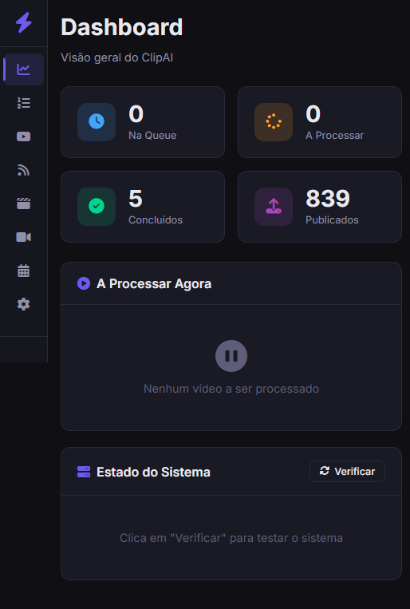
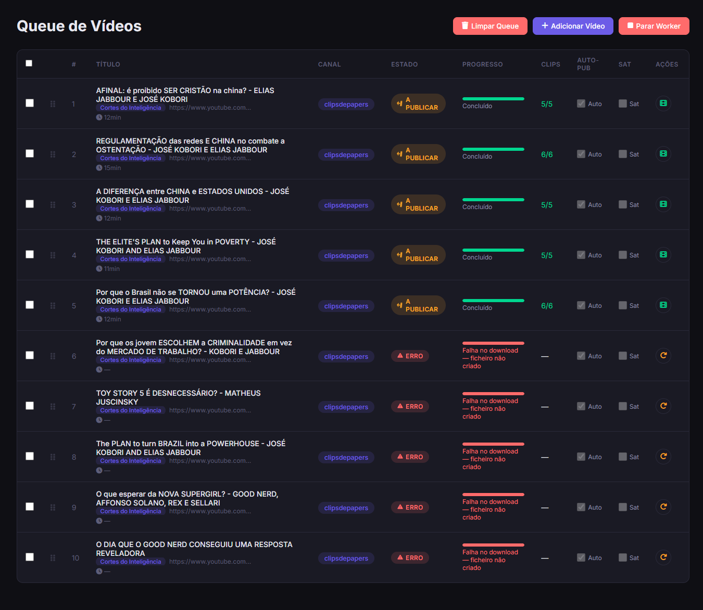
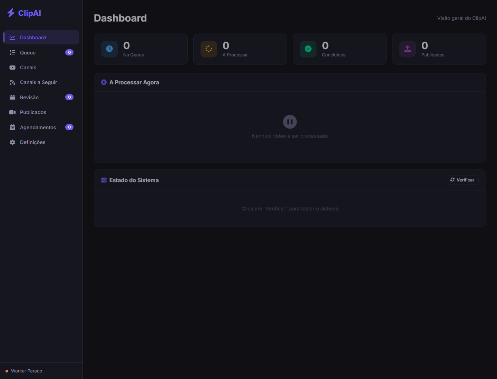
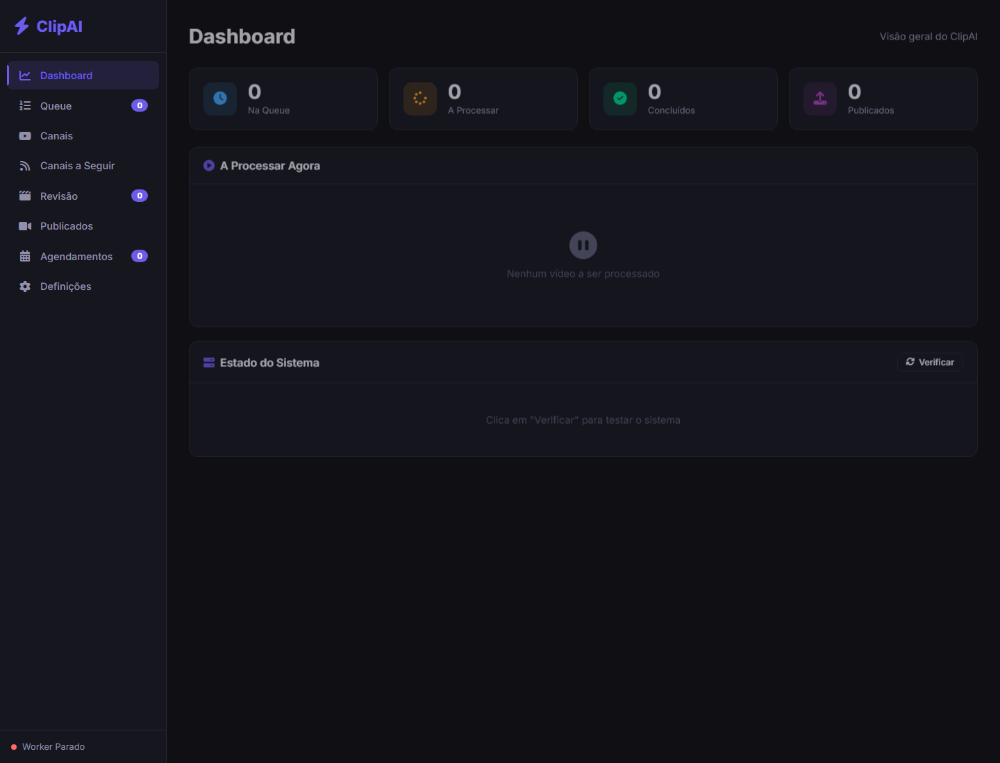

# ClipAI


ClipAI takes long YouTube videos, transcribes them with Whisper, uses a local LLM (Ollama) to pick the best moments, edits them into vertical clips with subtitles, and optionally publishes them to YouTube Shorts. Everything runs locally — no cloud, no subscriptions, no data leaving your machine.

## Demo

[](https://www.youtube.com/watch?v=O3AHu_EP7CM)

In the video above I walk through ClipAI end to end.

## How it works

```text
YouTube URL → download → transcription (Whisper) → analysis (Ollama)
  → vertical editing with subtitles → review → publish to YouTube
```

You drop a URL into the queue, and the worker handles the rest: downloads the video, transcribes the audio, asks Ollama to pick the most interesting moments, edits each clip into vertical format, and queues them for review before publishing.

## The app

### Dashboard



Main dashboard — shows counters for videos in queue, processing, done and published, plus the worker status and what's currently being downloaded.

### Queue



Video Queue — lists every video waiting to be processed, with title, target channel, status (downloading, publishing, queued), progress and quick actions (retry, delete, change channel, auto-publish).

### Channels



Channel Management — where you connect YouTube channels via OAuth for publishing clips. Each card shows subscribers, published videos and views, and lets you test the connection, swap accounts or disable the channel.

### Watched Channels



Watched Channels — ClipAI auto-scans these source channels (in this example, `windohclips`) looking for new videos to turn into clips. Each video shows how many days ago it was published, whether clips already exist, and can be added to the queue in one click.

## Requirements

- Python 3.9+
- FFmpeg and FFprobe on PATH
- Ollama installed with at least one model pulled (e.g. `ollama pull llama3.1`)
- Enough disk space for downloaded videos and generated clips
- Optional: NVIDIA GPU/CUDA for faster transcription
- Optional: Google OAuth credentials to publish to YouTube

## Install and run

```powershell
git clone https://github.com/2mas-magalhaes/ClipperAI.git
cd ClipperAI

python -m venv venv
.\venv\Scripts\activate

$env:PYTHONUTF8 = "1"
$env:PYTHONIOENCODING = "utf-8"
python -m pip install -r requirements.txt

Copy-Item .env.example .env
python app.py
```

Then open [http://localhost:5000](http://localhost:5000).

## Configuration (.env)

Copy `.env.example` to `.env` and fill in what you need:

| Variable | Description |
| --- | --- |
| `OLLAMA_MODEL` | Local model to use for analysis (e.g. `llama3.1`) |
| `OLLAMA_API_URL` | Ollama API URL, usually `http://localhost:11434` |
| `WHISPER_MODEL` | Faster-Whisper model (e.g. `medium`) |
| `RAPIDAPI_KEY` | Optional — enables RapidAPI download fallback |
| `GOOGLE_CREDENTIALS_FILES` | Local paths to Google OAuth credential files |

Never commit `.env`, OAuth credential files or generated tokens.

## Project structure

```text
app.py                    # Flask dashboard and HTTP API
worker.py                 # Background queue worker
database.py               # Local JSON persistence
modulo1_download.py       # YouTube video download
modulo2_analise.py        # Transcription (Whisper) and analysis (Ollama)
modulo3_edicao.py         # Vertical editing with FFmpeg/OpenCV
credentials_rotation.py   # OAuth credential rotation
auto_manager.py           # Auto-scan of watched channels
personagem_clippy.py      # Clippy character logic
templates/index.html      # Web interface
static/app.js             # Client-side logic
requirements.txt          # Python dependencies
.env.example              # Configuration template
```

## Security

Secrets stay in `.env` and local credential files only — both are gitignored. `RAPIDAPI_KEY` is disabled when empty. If a secret was ever accidentally committed, revoke it outside the repository before doing anything else.

## License

MIT — see [`LICENSE`](LICENSE).
